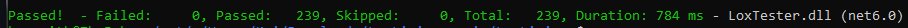

# LoxLiaison
LoxLiaison is a C# implementation of a Lox interpreter, based heavily upon jlox from the book [*Crafting Interpreters* by Robert Nystrom](https://craftinginterpreters.com/). This project was developed primarily as an assignment for CS 403/503 - Programming Languages (Fall 2023) at the University of Alabama. During development, I attempted to stay as true to the original functionality of jlox as possible, mainly modifying data structures as needed to create equivalent code flow.

LL has been tested on Windows 10 and Ubuntu 22.04; if you'd like to test it on your own system, please follow the instructions under [Building](#building) and open up an issue if you have any trouble!

## Usage
When run without an argument, LL operates as a <abbr title="read-eval-print loop">REPL</abbr> prompt which runs until it encounters an exit code. Otherwise, when given a Lox source file, LL will attempt to execute it and then exit.
```
LoxLiaison [Lox script]
```

## Building
Building and running LoxLiaison requires the .NET 6.0 SDK. It can be installed via a package manager, such as ``apt`` or ``snap``, or from the [.NET download website](https://dotnet.microsoft.com/en-us/download/dotnet/6.0).
```
sudo apt-get install dotnet-sdk-6.0
```
On Windows, it can be installed via the Windows Package Manager, ``winget``, or from the aforementioned download site.
```
winget install Microsoft.DotNet.SDK.6
```
Once installed, clone the repository to a location of your choosing.
```
git clone https://github.com/resistiv/LoxLiaison.git
```
Navigate to the folder containing the file ``LoxLiaison.sln``, and run the following:
```
dotnet build
```
The resulting executables will be built to the ``bin`` subfolders of each project within the solution, from which they can be run.

## Testing
This repository makes use of [Robert Nystrom's Lox unit tests](https://github.com/munificent/craftinginterpreters/tree/master/test), excluding some tests that would be used for clox.
For ease of generation, all unit test classes are generated using the ``LoxTestGenerator`` project.

For even easier use, two scripts are provided for Unix (``BuildTests.sh``) and Windows (``BuildTests.bat``) to generate the test cases classes for the ``LoxTester`` project. Both scripts will:
- Build the solution to ensure ``LoxTestGenerator`` is built
- Run ``LoxTestGenerator``, loading tests from ``/LoxTester/Tests`` and outputting to ``/LoxTester``
- Build the solution again to incorporate the newly generated tests

Run the appropriate script to build the tests and run the following to run the test cases:
```
dotnet test
```
The number of successful and failed tests will be displayed.

As of commit ``21de197``, everything builds, runs, and all tests pass on Windows 10 and Ubuntu 22.04.

